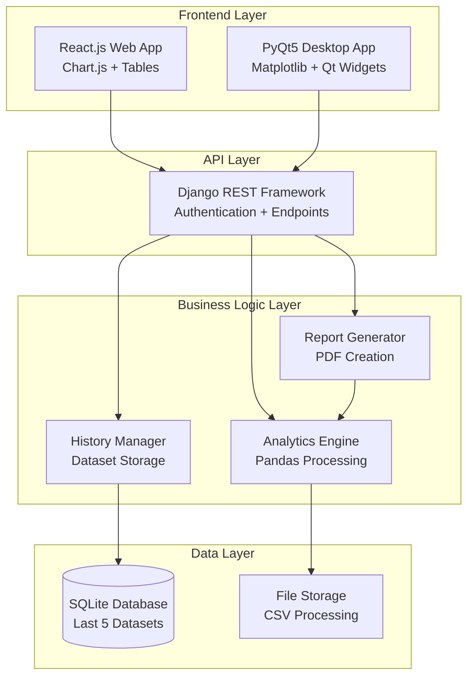
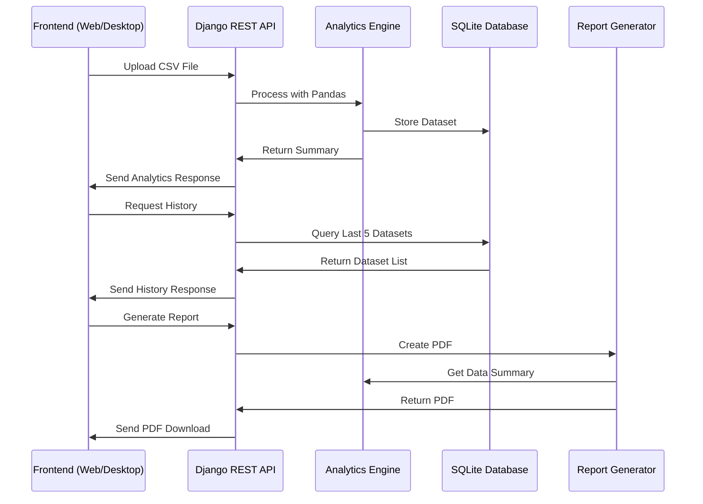

# Design Document

## Overview

The Chemical Equipment Parameter Visualizer is a hybrid application system that provides comprehensive data visualization and analytics for chemical equipment parameters. The architecture follows a client-server pattern with a centralized Django REST API backend serving two distinct frontend applications: a React.js web application and a PyQt5 desktop application. This design ensures data consistency, code reusability, and platform flexibility while maintaining a unified user experience across different interfaces.

The system processes CSV files containing chemical equipment data, performs analytics using Pandas, stores historical datasets in SQLite, and provides interactive visualizations through Chart.js (web) and Matplotlib (desktop). Authentication controls access, and PDF report generation enables data sharing and documentation.

## Architecture

### System Architecture



### Component Interaction Flow



## Components and Interfaces

### Backend API Components

#### Django REST Framework API Server
- **Purpose**: Central API server providing RESTful endpoints
- **Technology**: Django + Django REST Framework
- **Responsibilities**:
  - Handle HTTP requests from both frontend applications
  - Coordinate between business logic components
  - Manage authentication and authorization
  - Provide consistent JSON responses

#### Analytics Engine
- **Purpose**: Process CSV data and generate statistical summaries
- **Technology**: Python + Pandas
- **Key Methods**:
  - `process_csv(file_path)`: Parse and validate CSV structure
  - `calculate_summary(dataframe)`: Generate count, averages, distributions
  - `validate_equipment_data(dataframe)`: Ensure required columns exist
- **Data Processing**:
  - Parse CSV files with columns: Equipment Name, Type, Flowrate, Pressure, Temperature
  - Calculate total equipment count
  - Compute average values for numeric parameters
  - Generate equipment type distribution statistics

#### History Manager
- **Purpose**: Manage dataset storage and retrieval
- **Technology**: Django ORM + SQLite
- **Key Methods**:
  - `store_dataset(csv_data, metadata)`: Save new dataset
  - `get_recent_datasets(limit=5)`: Retrieve last 5 datasets
  - `cleanup_old_datasets()`: Remove datasets beyond limit
- **Storage Strategy**:
  - Maintain rolling window of 5 most recent datasets
  - Store both raw data and computed summaries
  - Include metadata: filename, upload timestamp, record count

#### Report Generator
- **Purpose**: Create PDF reports from analytics data
- **Technology**: Python + ReportLab/WeasyPrint
- **Key Methods**:
  - `generate_pdf_report(dataset_summary)`: Create formatted PDF
  - `include_charts(summary_data)`: Embed visualization charts
  - `format_statistics_table(data)`: Create tabular summaries

### Frontend Components

#### React.js Web Application
- **Purpose**: Browser-based interface for equipment data analysis
- **Technology**: React.js + Chart.js + Axios
- **Key Components**:
  - `FileUploadComponent`: Handle CSV file selection and upload
  - `DataVisualizationComponent`: Render charts using Chart.js
  - `HistoryComponent`: Display and select from recent datasets
  - `ReportComponent`: Generate and download PDF reports
  - `AuthenticationComponent`: Handle user login/logout

#### PyQt5 Desktop Application
- **Purpose**: Native desktop interface with identical functionality
- **Technology**: PyQt5 + Matplotlib + Requests
- **Key Components**:
  - `MainWindow`: Primary application window and navigation
  - `FileUploadWidget`: CSV file selection and upload interface
  - `ChartWidget`: Matplotlib-based data visualization
  - `HistoryWidget`: Dataset history management
  - `ReportWidget`: PDF report generation and viewing
  - `LoginDialog`: Authentication interface

### API Endpoints

#### Authentication Endpoints
- `POST /api/auth/login/`: User authentication
- `POST /api/auth/logout/`: Session termination
- `GET /api/auth/user/`: Current user information

#### Data Management Endpoints
- `POST /api/upload/`: CSV file upload and processing
- `GET /api/analytics/{dataset_id}/`: Retrieve dataset analytics
- `GET /api/history/`: List recent datasets with summaries
- `DELETE /api/datasets/{dataset_id}/`: Remove specific dataset

#### Report Generation Endpoints
- `POST /api/reports/generate/`: Create PDF report for dataset
- `GET /api/reports/{report_id}/download/`: Download generated PDF

## Data Models

### Database Schema

#### Dataset Model
```python
class Dataset(models.Model):
    id = models.AutoField(primary_key=True)
    filename = models.CharField(max_length=255)
    upload_timestamp = models.DateTimeField(auto_now_add=True)
    record_count = models.IntegerField()
    user = models.ForeignKey(User, on_delete=models.CASCADE)
    
    # Summary statistics
    avg_flowrate = models.FloatField()
    avg_pressure = models.FloatField()
    avg_temperature = models.FloatField()
    
    # Equipment type distribution (JSON field)
    type_distribution = models.JSONField()
```

#### Equipment Record Model
```python
class EquipmentRecord(models.Model):
    dataset = models.ForeignKey(Dataset, on_delete=models.CASCADE)
    equipment_name = models.CharField(max_length=255)
    equipment_type = models.CharField(max_length=100)
    flowrate = models.FloatField()
    pressure = models.FloatField()
    temperature = models.FloatField()
```

### API Response Formats

#### Analytics Summary Response
```json
{
  "dataset_id": 123,
  "summary": {
    "total_count": 150,
    "averages": {
      "flowrate": 45.7,
      "pressure": 12.3,
      "temperature": 298.5
    },
    "type_distribution": {
      "Pump": 45,
      "Valve": 32,
      "Heat Exchanger": 28,
      "Reactor": 25,
      "Compressor": 20
    }
  },
  "metadata": {
    "filename": "equipment_data.csv",
    "upload_time": "2024-01-15T10:30:00Z",
    "record_count": 150
  }
}
```

#### History Response
```json
{
  "datasets": [
    {
      "id": 123,
      "filename": "latest_equipment.csv",
      "upload_time": "2024-01-15T10:30:00Z",
      "record_count": 150,
      "summary": {
        "total_count": 150,
        "avg_flowrate": 45.7,
        "avg_pressure": 12.3,
        "avg_temperature": 298.5
      }
    }
  ]
}
```

## Correctness Properties

*A property is a characteristic or behavior that should hold true across all valid executions of a system—essentially, a formal statement about what the system should do. Properties serve as the bridge between human-readable specifications and machine-verifiable correctness guarantees.*

Before defining the correctness properties, I need to analyze the acceptance criteria from the requirements document to determine which ones are testable as properties.

### Core Properties

Property 1: CSV Upload and Processing
*For any* valid CSV file with equipment data columns (Equipment Name, Type, Flowrate, Pressure, Temperature), uploading through either web or desktop interface should result in successful parsing, validation, and storage in the database
**Validates: Requirements 1.1, 1.2, 1.3, 1.5, 1.6**

Property 2: Invalid Input Handling
*For any* invalid CSV file (wrong format, missing columns, corrupted data), the system should return descriptive error messages and prevent storage
**Validates: Requirements 1.4**

Property 3: Analytics Calculation Accuracy
*For any* valid dataset, the analytics engine should correctly calculate total equipment count, average values for numeric parameters (Flowrate, Pressure, Temperature), and equipment type distribution statistics
**Validates: Requirements 2.1, 2.2, 2.3**

Property 4: API Response Consistency
*For any* analytics request, the Backend_API should return properly formatted JSON containing all required summary fields (total count, averages, type distribution)
**Validates: Requirements 2.4, 2.5**

Property 5: Cross-Platform Visualization
*For any* dataset, both web (Chart.js) and desktop (Matplotlib) interfaces should successfully render charts and display all equipment records in tabular format
**Validates: Requirements 3.1, 3.2, 3.3, 3.4**

Property 6: History Management Rolling Window
*For any* sequence of dataset uploads, the History_Manager should maintain exactly the last 5 datasets, removing the oldest when the limit is exceeded, and preserve all metadata (timestamp, filename)
**Validates: Requirements 4.1, 4.2, 4.3, 4.5**

Property 7: Historical Data Retrieval
*For any* historical dataset selection, the system should display the correct analytics and visualizations for that specific dataset
**Validates: Requirements 4.4**

Property 8: PDF Report Generation
*For any* dataset, the Report_Generator should create a PDF containing summary statistics, distribution charts, timestamp, and metadata, downloadable from both interfaces
**Validates: Requirements 5.1, 5.2, 5.3, 5.4, 5.5**

Property 9: Authentication and Authorization
*For any* user access attempt, the system should require valid credentials for all protected endpoints, deny access with invalid credentials, handle session expiration, and allow access to all features upon successful authentication
**Validates: Requirements 6.1, 6.2, 6.3, 6.4, 6.5**

Property 10: API Interface Consistency
*For any* identical request made from web or desktop frontend, the Backend_API should process them through the same Django REST Framework endpoints and return identically formatted JSON responses
**Validates: Requirements 7.1, 7.2, 7.3, 7.4, 7.5**

## Error Handling

### Input Validation Errors
- **Invalid CSV Format**: Return HTTP 400 with specific format error details
- **Missing Required Columns**: Return HTTP 400 with list of missing columns
- **Invalid Data Types**: Return HTTP 400 with row-specific validation errors
- **Empty Files**: Return HTTP 400 with "empty file" error message

### Authentication Errors
- **Invalid Credentials**: Return HTTP 401 with "authentication failed" message
- **Session Expired**: Return HTTP 401 with "session expired" message
- **Missing Authentication**: Return HTTP 401 with "authentication required" message

### System Errors
- **Database Connection Failures**: Return HTTP 500 with generic error message, log specific details
- **File Processing Errors**: Return HTTP 500 with "processing failed" message
- **PDF Generation Failures**: Return HTTP 500 with "report generation failed" message

### Frontend Error Handling
- **Network Connectivity**: Display user-friendly "connection error" messages
- **API Timeouts**: Implement retry mechanisms with exponential backoff
- **File Size Limits**: Validate file size before upload attempt

## Testing Strategy

### Dual Testing Approach

The testing strategy employs both unit testing and property-based testing to ensure comprehensive coverage:

**Unit Tests**: Focus on specific examples, edge cases, and integration points
- Authentication flow with valid/invalid credentials
- CSV parsing with malformed files
- Database operations with edge cases
- API endpoint responses with specific data
- UI component rendering with sample data

**Property-Based Tests**: Verify universal properties across all inputs using generated test data
- Minimum 100 iterations per property test
- Each test tagged with: **Feature: chemical-equipment-visualizer, Property {number}: {property_text}**
- Comprehensive input coverage through randomization

### Property-Based Testing Configuration

**Technology Stack**:
- **Python Backend**: Use Hypothesis library for property-based testing
- **React Frontend**: Use fast-check library for property-based testing
- **PyQt5 Desktop**: Use Hypothesis with PyQt test utilities

**Test Configuration**:
- Each property test runs minimum 100 iterations
- Generate random CSV data with varying:
  - Equipment counts (1-1000 records)
  - Equipment types (5-20 different types)
  - Parameter ranges (realistic chemical equipment values)
  - File formats and structures

**Property Test Implementation**:
Each correctness property must be implemented as a single property-based test with appropriate tagging:

```python
# Example property test structure
@given(equipment_data=generate_equipment_csv())
def test_csv_upload_processing_property_1(equipment_data):
    """
    Feature: chemical-equipment-visualizer, Property 1: CSV Upload and Processing
    For any valid CSV file with equipment data columns, uploading should result 
    in successful parsing, validation, and storage
    """
    # Test implementation
```

### Integration Testing
- End-to-end workflows across web and desktop interfaces
- API consistency between different frontend clients
- Database operations with concurrent access
- File upload and processing pipelines

### Performance Testing
- Large CSV file processing (up to 10,000 records)
- Concurrent user access simulation
- Memory usage during data processing
- Response time benchmarks for API endpoints

### Security Testing
- Authentication bypass attempts
- SQL injection prevention
- File upload security validation
- Session management security